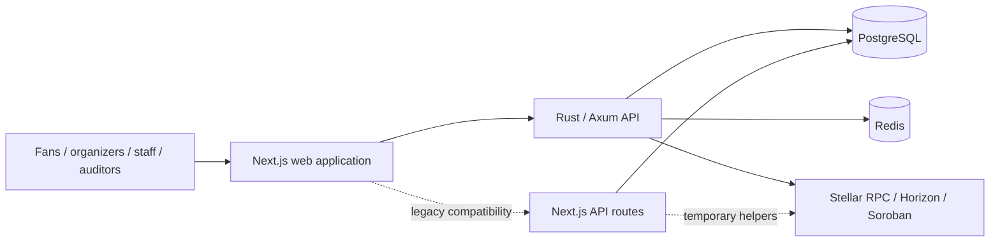

# CrownFi

CrownFi is a Stellar-powered platform for pageant voting, ticketing, contestant support, fan engagement, and digital collectibles.

The repository is currently in a **platform consolidation and productization refactor**. It preserves the working hackathon MVP while moving business logic and durable state toward a Rust/Axum API, PostgreSQL, Redis, and explicit Stellar Testnet integrations.

> **Status:** hackathon/Testnet platform under active reconstruction. CrownFi is suitable for collaborative development, demos, and Testnet validation. It is not yet production voting infrastructure, a mainnet financial system, or a replacement for legal tabulation, identity, ticketing, or financial-compliance processes.

## Product boundary

CrownFi uses a hybrid architecture:

- high-volume vote intake, eligibility, deduplication, and tallying remain off-chain;
- closed-round hashes and Merkle roots can be anchored to Soroban for tamper-evident verification;
- Stellar/Soroban is used for payments, tickets, collectibles, ownership, settlement, and audit commitments;
- raw voter identity and individual votes are not placed on-chain;
- tickets, purchases, collectibles, donations, and prediction stakes never multiply voting power.

This matches the real utility claim: Stellar provides verifiable ownership, value transfer, and audit commitments without pretending that every application action must be a blockchain transaction.

## Current architecture

The repository is transitional: the Next.js MVP remains available while domains are migrated into the Rust service one vertical slice at a time.



### Canonical responsibility boundaries

| Area | Canonical owner | Current transition state |
|---|---|---|
| UI, routing, wallet approval | Next.js | Active |
| Business rules and workflows | Rust/Axum API | Skeleton exists; domains are still being migrated |
| Durable application data | PostgreSQL | Prisma compatibility exists; SQLx becomes canonical in Milestone B |
| Rate limits, coordination, jobs | Redis | Container/configuration exists; durable use is incomplete |
| Voting audit commitments | Soroban audit-anchor contract | Testnet-capable; deployments require registry verification |
| Ticket/collectible ownership and settlement | Stellar/Soroban | Contracts and demo paths exist; indexing/reconciliation remain incomplete |
| Media | Cloudflare R2 | Planned for Milestone B; not active yet |
| KYC identity documents | External KYC provider | Planned; CrownFi must not store raw identity documents in the general media bucket |

Next.js business route handlers and Prisma remain temporary compatibility paths. New platform domains should be implemented in Rust and exposed through documented API contracts.

## Repository layout

```text
.
├── web/                         # Next.js UI, wallet UX, and legacy compatibility routes
├── services/api/                # Rust/Axum canonical API under construction
├── contracts/                   # Soroban contracts
├── infra/docker-compose.yml     # Canonical local platform stack
├── compose.yaml                 # Legacy web-only compatibility stack
├── scripts/acceptance/          # Reproducibility and smoke-test scripts
├── docs/
│   ├── architecture/            # Runtime, migration, and platform decisions
│   ├── blockchain/              # Stellar integration and deployment registry
│   ├── features/                # Feature behavior and constraints
│   ├── planning/                # Productization roadmap and inventories
│   ├── security/                # Audit notes and boundaries
│   ├── setup/                   # Local, hosted, and clean-clone setup
│   └── testing/                 # Acceptance matrices
├── CONTRIBUTING.md              # Branch, PR, and collaboration rules
└── SECURITY.md                  # Security policy
```

## Fastest clean-clone test

The canonical Milestone A smoke path requires Docker Compose v2 and `curl`.

```bash
git clone <repository-url> CrownFi
cd CrownFi
git switch integration/finale-platform-rebuild
bash scripts/acceptance/clean-clone-smoke.sh
```

The script:

1. creates `infra/.env.smoke` from safe local defaults when necessary;
2. builds and starts PostgreSQL, Redis, the Rust API, transitional database initialization, and Next.js;
3. checks service health;
4. stores evidence under `.artifacts/acceptance/clean-clone/`.

Local endpoints:

```text
Web:             http://127.0.0.1:3000
Web health:      http://127.0.0.1:3000/api/health
Rust API:        http://127.0.0.1:8080
API health:      http://127.0.0.1:8080/health
API readiness:   http://127.0.0.1:8080/ready
```

See [`docs/setup/clean-clone.md`](docs/setup/clean-clone.md) for the human acceptance procedure and current limitations.

## Manual platform startup

```bash
cp infra/.env.example infra/.env

docker compose \
  --env-file infra/.env \
  -f infra/docker-compose.yml \
  up --build
```

Stop the stack with:

```bash
docker compose \
  --env-file infra/.env \
  -f infra/docker-compose.yml \
  down
```

The example environment intentionally starts in:

```env
CROWNFI_API_MODE=local
STELLAR_MODE=mock
WALLET_PROVIDER=mock
```

Local startup must not silently become a live/Testnet environment.

## Runtime profiles

| Profile | Purpose | Mock behavior |
|---|---|---|
| `local` | Developer workstation and explicit demo seeds | Permitted and visibly labeled |
| `testnet` | Real Freighter and Stellar Testnet integration | No silent fallback |
| `staging` | Production-shaped hackathon deployment using Testnet | Mock endpoints and demo auth disabled |
| `production` | Future mainnet-capable configuration | Not enabled during the current phase |

When `STELLAR_MODE=live`, required contract IDs, network configuration, signer boundaries, and deployment records must be present. Missing configuration should disable the capability rather than generating a fake success result.

## Current feature state

### Existing MVP behavior to preserve

- pageant/fan web experience;
- off-chain voting and duplicate-vote concepts;
- tally hashes, Merkle roots, receipts, and verification UI;
- Freighter wallet connection/signing paths;
- ticket and collectible demonstrations;
- wallet-signed administrator sessions;
- secret scanning, dependency checks, Rust checks, and best-effort CodeQL;
- Arcturus and Compose deployment work;
- shared UI-kit foundation.

### Current platform gaps

- Rust events, contestants, votes, tallies, snapshots, markets, and intents are still process-local prototypes;
- PostgreSQL repositories and SQLx migrations are not implemented yet;
- Redis is not yet the durable coordination/rate-limit/job layer;
- Next.js and Rust contain duplicated domain paths;
- the live Supabase project had no CrownFi application tables at the last verified inspection;
- contract deployment IDs have not yet been entered and independently verified in the canonical registry;
- a separate worker, indexer, and reconciliation service do not yet exist;
- Cloudflare R2 media handling is planned, not active;
- production KYC and provider reconciliation are not implemented;
- prediction markets remain Testnet-only and disabled as a production feature.

See [`docs/planning/CAPABILITY_AND_HARDCODING_INVENTORY.md`](docs/planning/CAPABILITY_AND_HARDCODING_INVENTORY.md).

## Database authority

The current Compose bridge still runs the legacy Prisma schema and demo seed so the existing web application remains testable.

The platform decision is:

- SQLx migrations under `services/api/migrations/` become the canonical schema authority in Milestone B;
- Prisma remains temporary compatibility/reference material;
- new platform domains must not be designed only in Prisma;
- seed data is separated from migrations;
- destructive `prisma db push` use is prohibited against shared/staging databases after SQLx authority is activated.

See [`docs/architecture/database-migration-ownership.md`](docs/architecture/database-migration-ownership.md).

## Stellar Testnet configuration

The canonical deployment record is [`docs/blockchain/testnet-contract-registry.md`](docs/blockchain/testnet-contract-registry.md).

Supported compatibility variables include:

| Variable | Purpose |
|---|---|
| `AUDIT_ANCHOR_CONTRACT_ID` | Voting checkpoint commitment contract |
| `TICKET_CONTRACT_ID` | Ticket contract |
| `COLLECTIBLE_CONTRACT_ID` | Collectible contract |
| `SALE_SPLITTER_CONTRACT_ID` | Payment/listing split contract |
| `USDC_TEST_CONTRACT_ID` | Test asset contract |
| `STELLAR_PLATFORM_SECRET` | Transitional server-only signer; never expose to the browser |
| `DEMO_CONTESTANT_PAYOUT` | Transitional demo payout address |
| `EVENT_TREASURY_PAYOUT` | Transitional event treasury address |

An environment variable alone is not proof that a deployment is valid. The registry requires the network, contract ID, WASM hash, source revision, deployment transaction, status, and independent verification.

### Verify a transaction

Only a real 64-character Testnet transaction hash can be treated as a ledger receipt.

```text
https://stellar.expert/explorer/testnet/tx/<transaction-hash>
```

A mock hash will not exist in the explorer and must be labeled as simulated.

## Freighter boundary

CrownFi requests the connected public `G...` address and gives Freighter an unsigned transaction XDR to review and sign. CrownFi must never receive the user's seed phrase or private key.

- Desktop: use the Freighter browser extension in Testnet mode.
- Mobile: use Freighter's in-app browser when wallet injection is required.
- Regular mobile browsers do not provide the extension API.

The long-term transaction-intent service validates that a returned signed envelope still matches the stored operation, amount, destination, network, and expiration before submission.

## Contract development

Contracts live under [`contracts/`](contracts/).

```bash
cd contracts
cargo fmt --all -- --check
cargo test --workspace --locked
cargo audit
```

Build for Soroban:

```bash
rustup target add wasm32v1-none
cargo install --locked stellar-cli
cd contracts
stellar contract build
```

Use [`contracts/DEPLOY_GUIDE.md`](contracts/DEPLOY_GUIDE.md) and update the Testnet registry after deployment.

## Web checks

```bash
cd web
npm ci
npm audit --audit-level=moderate
npm audit --audit-level=moderate --omit=dev
npm run typecheck
npm run test:merkle
npm run test:ticketing
npm run build
```

## Rust API checks

```bash
cargo fmt --manifest-path services/api/Cargo.toml -- --check
cargo test --manifest-path services/api/Cargo.toml
```

## Collaboration model

The current consolidation branch is:

```text
integration/finale-platform-rebuild
```

The stable platform integration branch will be:

```text
integration/platform-v1
```

Vertical work should branch from the current integration head, for example:

```text
foundation/database-v1
foundation/api-runtime
slice/organizer-pageants
slice/voting-platform
slice/ticketing-platform
slice/collectibles-support
slice/loyalty
slice/prediction-markets
```

Do not:

- replace repository history with an unrelated root;
- force-push shared branches;
- reintegrate through ZIP archives;
- keep private full-application branches alive for weeks;
- combine unrelated schema, contract, UI, and deployment rewrites in one PR.

See [`CONTRIBUTING.md`](CONTRIBUTING.md).

## Roadmap

| Milestone | Scope |
|---|---|
| A | Canonical runtime, documentation, clean-clone acceptance, deployment registry, migration ownership |
| B | Organizations, pageants, contestants, SQLx/PostgreSQL, Redis, R2 media, dynamic contestant sections |
| C | Stellar collectible eCommerce, orders, KYC policy, minting, payouts, ownership reconciliation |
| D | Durable voting, receipts, tally snapshots, Soroban anchoring, scale/recovery tests |
| E | Ticket inventory, reservations, issuance, ownership, check-in, operations and staging |
| F | Loyalty, rewards, leaderboards, and carefully gated Testnet prediction markets |

The complete execution plan is in [`docs/planning/PLATFORM_V1_EXECUTION_PLAN.md`](docs/planning/PLATFORM_V1_EXECUTION_PLAN.md). The release gates are in [`docs/testing/PLATFORM_ACCEPTANCE_MATRIX.md`](docs/testing/PLATFORM_ACCEPTANCE_MATRIX.md).

## Security

Never commit:

- Stellar secret keys or seed phrases;
- `.env` files containing real credentials;
- database passwords;
- Supabase service-role keys;
- payment or KYC provider secrets;
- unrestricted platform signing keys;
- raw KYC documents.

Known limitations and security boundaries are documented in [`SECURITY.md`](SECURITY.md) and [`docs/security/security-audit.md`](docs/security/security-audit.md).

## Honest demo framing

CrownFi may currently be presented as:

> A production-shaped Stellar Testnet platform under active refactor, preserving a working pageant MVP while adding a canonical Rust API, persistent platform data, verifiable voting commitments, and Stellar ticket/collectible primitives.

CrownFi must not yet be presented as:

- production-ready election or legal pageant tabulation infrastructure;
- a mainnet-ready financial service;
- a system where Stellar processes every raw vote;
- a completed KYC, payment-provider, indexing, or reconciliation platform;
- a guaranteed solution to all ticket scalping;
- a production prediction-market service.
