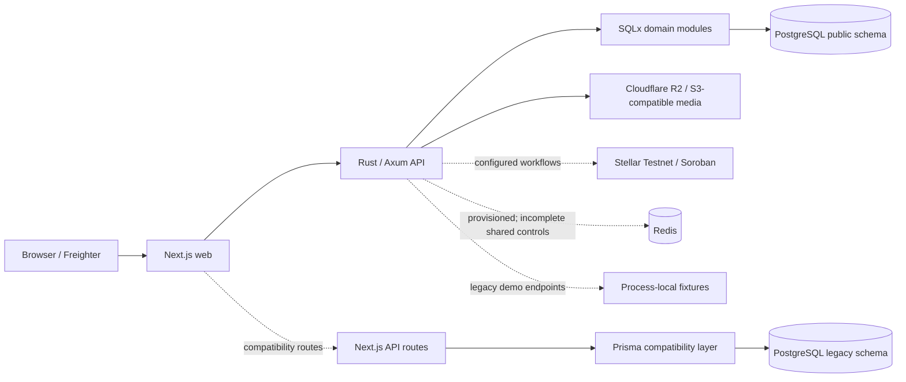

# CrownFi

CrownFi is a Stellar-powered platform for pageant voting, ticketing, contestant support, fan engagement, and digital collectibles.

> **Current status:** production-shaped hackathon/Testnet software under active consolidation. The default branch contains the persistent multi-tenant platform, the full-screen management shell, durable voting, durable ticketing, deterministic Testnet-only prediction-market state, R2-compatible media, commerce and Stellar-workflow foundations, and Arcturus deployment tooling. Those implementation slices are merged; their milestone acceptance gates are not complete.

CrownFi is not production voting infrastructure, a mainnet financial service, or a substitute for legal tabulation, identity, ticketing, gambling, or financial-compliance processes.

## Product boundary

CrownFi deliberately uses a hybrid architecture:

- vote intake, eligibility, deduplication, and tallying stay off-chain for privacy and burst handling;
- immutable closed-round commitments can be anchored to Soroban;
- Stellar/Soroban is used where ledger truth is valuable: payments, ticket and collectible ownership, settlement, and audit commitments;
- raw voter identities and individual selections are not published on-chain;
- purchases, tickets, donations, collectibles, and prediction stakes never increase voting power.

## What is on `main`

The default branch includes:

- a Next.js application with shared UI-kit components, pageant-aware navigation, a full-screen Manage workspace, and modular pageant-home rendering/editing;
- a Rust/Axum API with SQLx migrations and PostgreSQL-backed platform domains;
- users, linked Stellar accounts, organizations, memberships, pageants, categories, contestants, configurable contestant sections, and audit records;
- Cloudflare R2-compatible media upload intents, stored-byte integrity verification, contestant attachments, and per-asset completion serialization;
- commerce catalogue, integer-denominated prices, inventory, orders, payment events, persistent Stellar transaction intents, chain evidence, reconciliation records, collectible fulfillment, and payout records;
- durable voting rounds, idempotent vote intake, receipts, immutable Merkle snapshots/proofs, and audit-anchor intent/evidence records;
- durable ticket events/products, atomic reservations, issuance state, ownership/transfer evidence, verification, and replay-resistant check-in records;
- Testnet-gated prediction-market positions, exposure projections, deterministic result/refund plans, and submitted-versus-confirmed settlement evidence;
- first-administrator setup, account sessions, organization-scoped authorization foundations, and authorization-decision logging;
- explicit demo seeding, clean-clone acceptance scripts, image-build caching, and Arcturus/Compose deployment support.

## What remains incomplete

Merged code is not the same as an accepted product. Current open gates include:

- complete centralized capability classification and negative authorization tests for the newer voting, ticketing, and market mutation/worker routes;
- real Testnet signing, submission, independently sourced indexing, exact reconciliation, and Explorer evidence for every claimed ledger workflow;
- Redis-backed shared rate limits, coordination, and job processing where required;
- complete organizer/operator/auditor recovery interfaces;
- KYC/payment-provider integration and action policy;
- media variants, authoritative decoding/dimensions, pending-upload expiry, orphan cleanup, replacement/removal, and retirement policy;
- concurrency, restart, outage, replay, drift, browser, role, device, accessibility, deployment, rollback, and exact deployed-SHA evidence;
- OpenAPI publication and a generated, pinned TypeScript client;
- removal of the remaining process-local and Prisma compatibility paths.

Prediction markets remain **Testnet-only and gated**. Their merged deterministic state machines do not make CrownFi a production prediction-market service.

See [`docs/status/CURRENT_IMPLEMENTATION_STATUS.md`](docs/status/CURRENT_IMPLEMENTATION_STATUS.md) for the dated evidence boundary.

## Architecture



Canonical boundaries:

- Next.js owns rendering, navigation, wallet approval, browser sessions, and user-facing failure/retry states.
- Rust owns business rules, authorization, persistence, transaction-intent lifecycle, and reconciliation workflows.
- PostgreSQL `public` is canonical for new platform data through SQLx migrations.
- Prisma uses the temporary `legacy` schema only for compatibility routes.
- R2 is authoritative for media bytes; PostgreSQL is authoritative for media identity and lifecycle metadata.
- Stellar is authoritative only after accepted ledger/contract evidence is independently indexed and reconciled.

Details: [`docs/architecture/current-platform.md`](docs/architecture/current-platform.md).

## Quick start

Requirements: Git, Docker with Compose v2, `curl`, approximately 8 GB available RAM, and 10–15 GB free disk space.

```bash
git clone https://github.com/akippnn/CrownFi.git
cd CrownFi
git switch main
git pull --ff-only
bash scripts/acceptance/clean-clone-smoke.sh
```

The smoke builds the canonical stack, applies SQLx migrations, initializes the compatibility schema, waits for health/readiness, and stores evidence under `.artifacts/acceptance/clean-clone/`.

Local endpoints:

```text
Web:             http://127.0.0.1:3000
Web health:      http://127.0.0.1:3000/api/health
Rust API:        http://127.0.0.1:8080
API health:      http://127.0.0.1:8080/health
API readiness:   http://127.0.0.1:8080/ready
```

The default local profile is explicit local/mock operation. A passing local smoke does not prove Testnet settlement or production deployment.

Full procedure: [`docs/setup/clean-clone.md`](docs/setup/clean-clone.md).

## Explicit demo data

Normal startup and migrations do not seed canonical product data.

```bash
cp infra/.env.example infra/.env

docker compose --env-file infra/.env -f infra/docker-compose.yml up --build -d

docker compose --env-file infra/.env -f infra/docker-compose.yml run --rm \
  -e CROWNFI_ALLOW_DEMO_SEED=true \
  api crownfi-api seed demo
```

The seed is opt-in, idempotent, and rejected in staging/production profiles. See [`docs/setup/demo-seed.md`](docs/setup/demo-seed.md).

## Development checks

Web:

```bash
cd web
npm ci
npm run check
npm run build
npm audit --audit-level=moderate
```

Rust API:

```bash
cargo fmt --manifest-path services/api/Cargo.toml -- --check
cargo test --manifest-path services/api/Cargo.toml --locked
```

Contracts:

```bash
cd contracts
cargo fmt --all -- --check
cargo test --workspace --locked
cargo audit
```

Focused acceptance scripts live under `scripts/acceptance/`. Their result is evidence only for the exact tested branch/SHA and environment.

## Documentation map

Start with:

- [`docs/README.md`](docs/README.md) — documentation index and truth labels;
- [`docs/status/CURRENT_IMPLEMENTATION_STATUS.md`](docs/status/CURRENT_IMPLEMENTATION_STATUS.md) — merged implementation and remaining gates;
- [`docs/architecture/current-platform.md`](docs/architecture/current-platform.md) — runtime and authority boundaries;
- [`docs/api/RUST_API_ENDPOINTS.md`](docs/api/RUST_API_ENDPOINTS.md) — Rust route inventory and transport caveats;
- [`docs/setup/clean-clone.md`](docs/setup/clean-clone.md) — reproducible startup and evidence;
- [`docs/testing/PLATFORM_ACCEPTANCE_MATRIX.md`](docs/testing/PLATFORM_ACCEPTANCE_MATRIX.md) — product gates;
- [`CONTRIBUTING.md`](CONTRIBUTING.md) — branch, PR, migration, and documentation rules;
- [`SECURITY.md`](SECURITY.md) — security policy.

## Branch and review rule

Create short-lived branches from the exact target branch. Every PR must separate:

- what the branch implements;
- what automated tests prove;
- what still needs human, Testnet, concurrency, restart, deployment, or independent verification evidence.

A checked implementation task does not waive a separate acceptance gate. Do not replace the repository with ZIP snapshots, unrelated-root histories, or stale full-tree branches.

## Deployment boundary

Production deployment is main-only and uses immutable full-SHA images, digest-based release manifests, pre-push size policy, and Arcturus verification. Remote Buildah caches and `cargo-chef` reduce repeated compilation without changing release identity.

A narrowly matched legacy-preflight compatibility path exists for an older Arcturus host. It fails closed on authentication, authorization, transport, and unexpected errors. Upgrading the host to the current authenticated preflight path remains required.

## Honest demo framing

CrownFi may be described as:

> A production-shaped Stellar Testnet platform with persistent multi-tenant pageant management, durable voting and ticketing primitives, R2-compatible media and commerce workflows, and gated deterministic market-settlement foundations.

Do not claim that CrownFi is already:

- production-ready legal pageant tabulation;
- mainnet-ready financial infrastructure;
- fully reconciled across every Stellar workflow;
- a completed KYC/payment-provider platform;
- guaranteed to eliminate ticket scalping;
- a production prediction-market service.
