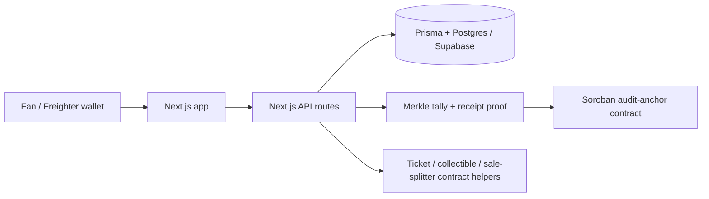

# CrownFi

CrownFi is a hackathon/testnet MVP for pageant voting, ticketing, fan rewards, contestant support, and digital collectibles. The current mainline app is a **Next.js full-stack demo**: the UI and API routes live in `web/`, data is handled through Prisma/Postgres, and Stellar/Soroban is used for audit proofs and asset/payment primitives where configured.

> **Status:** hackathon MVP. This repository is suitable for demos, review, and iteration. It is **not** production-ready voting infrastructure, mainnet financial infrastructure, or a replacement for legal tabulation/compliance systems.

## Mainline architecture

The current mainline branch is intentionally simple so the team can demo it quickly:



Important framing:

- Voting is **backend-first/off-chain** for speed and privacy.
- Stellar is used for **tamper-evident audit commitments, payments, ticket/collectible primitives, and proof records**.
- CrownFi does **not** put every raw vote on-chain.
- Fan support, ticket purchases, and collectibles do **not** multiply vote power.
- Ticketing can reduce counterfeits and improve verifiable ownership, but it does **not** fully eliminate off-platform scalping.

## Repository layout

```text
.
├── web/                    # Active Next.js 15 app: UI, API routes, Prisma, wallet flows
├── contracts/              # Soroban Rust workspace: audit anchor, tickets, collectibles, sale splitter, test USDC
├── docs/                   # Structured project documentation
│   ├── overview/           # Product overview and hackathon pitch
│   ├── architecture/       # Current platform, component boundaries, future refactor plan
│   ├── features/           # Voting, ticketing, verification, admin, collectibles
│   ├── blockchain/         # Stellar/Soroban and transaction verification notes
│   ├── setup/              # Supabase, local setup, deployment notes
│   ├── security/           # Security audit notes
│   └── planning/           # Refactor TODOs
├── SECURITY.md             # Root security policy and reporting notes
├── SUPABASE.md             # Compatibility pointer to Supabase setup docs
├── USER_FLOW.md            # Compatibility pointer to demo walkthrough
├── WORKFLOW.md             # Compatibility pointer to workflow docs
└── DEPLOY.md               # Compatibility pointer to deployment docs
```

> The Rust/Axum API and Docker Compose platform split are **future/refactor work**, not the active mainline runtime. See `docs/architecture/platform-refactor-plan.md` for that plan.

## Stack in mainline

| Area | Current implementation |
|---|---|
| Web app | Next.js 15 App Router, React 19, TypeScript, Tailwind CSS |
| API/backend | Next.js route handlers under `web/src/app/api` |
| Database | Prisma + Postgres; Supabase is the team-supported hosted Postgres path |
| Wallet | Freighter for Stellar wallet connection/signing; mock/demo session paths still exist |
| Blockchain | Stellar Testnet + Soroban Rust contracts where `STELLAR_MODE=live` is configured |
| Contracts | `audit-anchor`, `ticket`, `collectible`, `sale-splitter`, `usdc-test` |
| CI/security | CodeQL code scanning for JavaScript/TypeScript, Rust, and GitHub Actions; npm audit; TypeScript and Merkle tests; Rust format/tests/audit; secret smoke test |

## What the app currently does

### Fan flows

- Browse the pageant demo experience.
- Connect or create a fan session.
- Vote for a contestant in an open round.
- View receipt/proof information after a round is closed.
- Buy or mint demo tickets.
- View ticket voucher/check-in flows.
- Collect contestant memorabilia in demo/testnet mode.

### Admin flows

- Sign in through wallet-signed admin challenge flow.
- Create/manage contestants and rounds.
- Close rounds and generate tally snapshots.
- Anchor voting proofs in mock mode or Stellar/Soroban live mode when contract IDs are configured.
- Review organizer/admin-facing dashboard data.

### Voting/proof flow

1. A fan submits a vote through the web app.
2. The API route validates the round and duplicate-vote rules.
3. Prisma writes the vote to Postgres.
4. The database/application layer prevents duplicate votes per fan/round.
5. On close, the app computes a tally hash and Merkle root.
6. The proof is stored locally and can be anchored to Soroban when live mode is configured.
7. The verification page displays proof metadata without putting voter personal data on-chain.

## Quick start

### Requirements

- Node.js 22+ recommended, or the version used by CI.
- npm.
- A Postgres database. Supabase is supported because the current team setup uses it.
- Rust toolchain only if running Soroban contract checks.

### Web app setup

```bash
cd web
cp .env.example .env
npm ci
npx prisma migrate dev --name init
npm run seed
npm run dev
```

Open:

```text
http://localhost:3000
```

For Supabase/Postgres, configure `web/.env`:

```env
DATABASE_URL="postgresql://...pooler.supabase.com:6543/postgres?pgbouncer=true"
DIRECT_URL="postgresql://...pooler.supabase.com:5432/postgres"
```

Use [`docs/setup/supabase.md`](docs/setup/supabase.md) for the team’s Supabase path. A self-hosted Postgres instance can also work as long as the Prisma connection strings are set correctly.

## Environment variables

The main environment file is `web/.env`. Start from `web/.env.example`.

### Database

| Variable | Purpose |
|---|---|
| `DATABASE_URL` | Pooled/runtime Postgres connection for the app |
| `DIRECT_URL` | Direct Postgres connection for Prisma migrations |

### App/wallet mode

| Variable | Purpose |
|---|---|
| `WALLET_PROVIDER` | `mock` by default; future embedded-wallet adapters may be added later |
| `STELLAR_MODE` | `mock` by default; use `live` only after contract deployment/configuration |
| `STELLAR_NETWORK` | Usually `testnet` during the hackathon/demo phase |
| `STELLAR_RPC_URL` | Soroban RPC endpoint |
| `NEXT_PUBLIC_STELLAR_NETWORK` | Client-visible Stellar network label |
| `NEXT_PUBLIC_STELLAR_NETWORK_PASSPHRASE` | Client-visible Stellar network passphrase |

### Admin authentication

| Variable | Purpose |
|---|---|
| `ADMIN_WALLETS` | Server-side comma-separated allowlist of admin `G...` addresses |
| `NEXT_PUBLIC_ADMIN_WALLETS` | Client UI hint only; not a security boundary |
| `ADMIN_SESSION_SECRET` | HMAC secret for httpOnly admin session cookies |
| `NEXT_PUBLIC_APP_ORIGIN` | Optional app origin used in challenge text |

Generate a strong admin session secret with:

```bash
openssl rand -base64 32
```

### Stellar contract IDs

When using `STELLAR_MODE=live`, set deployed Soroban contract IDs:

| Variable | Purpose |
|---|---|
| `AUDIT_ANCHOR_CONTRACT_ID` | Round Merkle/tally anchor contract |
| `TICKET_CONTRACT_ID` | Ticket contract |
| `COLLECTIBLE_CONTRACT_ID` | Collectible contract |
| `SALE_SPLITTER_CONTRACT_ID` | Listing/payment split contract |
| `USDC_TEST_CONTRACT_ID` | Demo/test USDC contract |
| `STELLAR_PLATFORM_SECRET` | Server-only platform signing key for platform-authorized operations |
| `DEMO_CONTESTANT_PAYOUT` | Demo payout wallet used by listing registration scripts |

Do not commit `.env`, private keys, seed phrases, database passwords, Supabase service-role keys, or Stellar secret keys.

## Smart contracts

Contracts live in [`contracts/`](contracts/).

```text
contracts/
├── audit-anchor/    # voting round checkpoints / Merkle roots
├── ticket/          # ticket asset primitive
├── collectible/     # contestant collectible primitive
├── sale-splitter/   # listing-based payment split primitive
└── usdc-test/       # mintable test token for demos
```

### Contract checks

```bash
cd contracts
cargo fmt --all -- --check
cargo test --workspace --locked
cargo audit
```

`cargo audit --deny warnings` may report advisory warnings from transitive Soroban/Arkworks dependencies. These are documented in [`docs/security/security-audit.md`](docs/security/security-audit.md) and are kept visible but non-blocking in CI.

### Testnet deployment

Install the toolchain:

```bash
rustup target add wasm32v1-none
cargo install --locked stellar-cli
```

Generate and fund a testnet identity:

```bash
stellar keys generate alice --network testnet --fund
```

Build contracts:

```bash
cd contracts
stellar contract build
```

Use [`contracts/DEPLOY_GUIDE.md`](contracts/DEPLOY_GUIDE.md) for the full deployment runbook and contract wiring steps.

## Freighter, Stellar Testnet, and live transaction receipts

Freighter is the non-custodial wallet boundary in CrownFi. CrownFi asks Freighter for a public
`G...` address and gives it an unsigned transaction XDR to review and sign. CrownFi never receives
the wallet's recovery phrase or private key.

In live mode, the flow is:

1. The fan connects a **Testnet** Freighter account. The account needs Testnet XLM for Stellar fees.
2. CrownFi prepares a Soroban payment transaction using that account as the source.
3. Freighter displays the transaction for approval and returns signed XDR to CrownFi.
4. CrownFi verifies the short-lived transaction intent, submits the signed XDR to Soroban RPC, and
   waits for Testnet confirmation.
5. CrownFi mints the ticket or collectible in a separate platform-authorized transaction, then
   stores both resulting hashes with the app record.

The same pattern is used for a voting checkpoint, except the allowlisted admin signs the
`audit-anchor.publish` transaction and no fan payment is involved. Vote intake and tallying remain
off-chain; the closed-round Merkle root and tally hash are what get anchored.

### Use Freighter on desktop or mobile

- **Desktop:** install the Freighter browser extension, select Testnet, unlock the intended account,
  then choose **Connect Freighter** in CrownFi.
- **Mobile:** Freighter has iOS and Android apps. Open CrownFi in Freighter's in-app Discover browser
  so its wallet API is available to the site. A regular mobile browser does not inject the Freighter
  extension API, so it cannot complete CrownFi's connect-and-sign flow.

### See a transaction live

Only a 64-character transaction hash returned while `STELLAR_MODE=live` is a Testnet receipt.
Open it in Stellar Expert:

```text
https://stellar.expert/explorer/testnet/tx/<transaction-hash>
```

Ticket and collectible purchases produce two links: the **buyer-signed payment/split** and the
**platform-authorized mint**. Closing a round produces the **admin-signed anchor** link. A hash from
`STELLAR_MODE=mock` is simulated and will not exist on the explorer.

For an end-to-end test checklist, see [`docs/demo/user-flow.md`](docs/demo/user-flow.md); for
deployment prerequisites, see [`contracts/DEPLOY_GUIDE.md`](contracts/DEPLOY_GUIDE.md).

## Demo flow

A minimal reviewer/demo path:

1. Start the app.
2. Connect/create a fan account.
3. Vote for a contestant.
4. Sign in as admin using an allowlisted Stellar wallet.
5. Create or close a voting round.
6. Anchor the round result in mock mode or live testnet mode.
7. Verify a vote receipt against the Merkle root.
8. Try ticket and collectible flows in mock/testnet mode.

See [`docs/demo/user-flow.md`](docs/demo/user-flow.md) for the longer walkthrough.

## Security posture

The mainline includes an MVP security hardening pass that is appropriate for a hackathon/testnet demo, not production use.

Current hardening includes:

- server-side wallet-signed admin sessions;
- httpOnly admin session cookies;
- server-side checks on sensitive admin routes;
- short-lived transaction intents for signed XDR confirmation;
- live-mode rejection for direct mock mint endpoints;
- faucet rate/amount limits;
- dependency audit cleanup;
- committed-secret smoke tests;
- removal of local/generated artifacts from version control.

Known limitations:

- fan/user wallet sessions are not yet cryptographically enforced server-side across all flows;
- payment and mint are not fully atomic yet;
- in-memory challenges, sessions, rate limits, and transaction intents are demo/server-singleton only;
- contract IDs and live-mode configuration need final testnet validation before presenting live Stellar flows;
- a deeper external review is required before any mainnet, real-money, or real voter-data usage.

See [`SECURITY.md`](SECURITY.md) and [`docs/security/security-audit.md`](docs/security/security-audit.md).

## CI and local validation

Run these before pushing or asking for review:

```bash
cd web
npm ci
npm audit --audit-level=moderate
npm audit --audit-level=moderate --omit=dev
npm run typecheck
npm run test:merkle
```

```bash
cd contracts
cargo fmt --all -- --check
cargo test --workspace --locked
cargo audit
```

Optional advisory visibility check:

```bash
cd contracts
cargo audit --deny warnings
```

The advanced CodeQL workflow runs on pull requests targeting `main`, pushes to `main`, a weekly schedule, and manual dispatch. It analyzes JavaScript/TypeScript, Rust, and GitHub Actions workflows in parallel with the `security-extended` and `security-and-quality` query suites, then uploads results to the repository Security tab. The separate security workflow continues to run dependency, type, test, contract, and committed-secret checks.

## Useful docs

| Document | Purpose |
|---|---|
| [`docs/README.md`](docs/README.md) | Documentation map |
| [`docs/overview/hackathon-pitch.md`](docs/overview/hackathon-pitch.md) | Hackathon/project narrative |
| [`docs/architecture/current-platform.md`](docs/architecture/current-platform.md) | Current mainline architecture |
| [`docs/features/voting.md`](docs/features/voting.md) | Voting flow and constraints |
| [`docs/features/ticketing.md`](docs/features/ticketing.md) | Ticketing flow and anti-scalping framing |
| [`docs/features/verification.md`](docs/features/verification.md) | Audit/proof verification flow |
| [`docs/blockchain/stellar-soroban.md`](docs/blockchain/stellar-soroban.md) | Stellar/Soroban integration notes |
| [`docs/blockchain/transaction-verification.md`](docs/blockchain/transaction-verification.md) | How transaction/proof verification should be presented |
| [`docs/setup/supabase.md`](docs/setup/supabase.md) | Supabase/Postgres setup |
| [`docs/security/security-audit.md`](docs/security/security-audit.md) | Security audit notes and remaining risks |

## MVP boundaries

CrownFi should be presented as:

> A scalable off-chain voting MVP with Stellar-anchored audit proofs, Stellar/Soroban ticket and collectible primitives, and testnet/mock payment flows.

CrownFi should **not** be presented as:

- a production voting authority;
- a mainnet-ready financial application;
- a system where Stellar directly processes every vote;
- a complete replacement for legal tabulation, identity verification, or event ticketing compliance.

Keep demos on testnet/mock mode until the remaining production risks are addressed.
