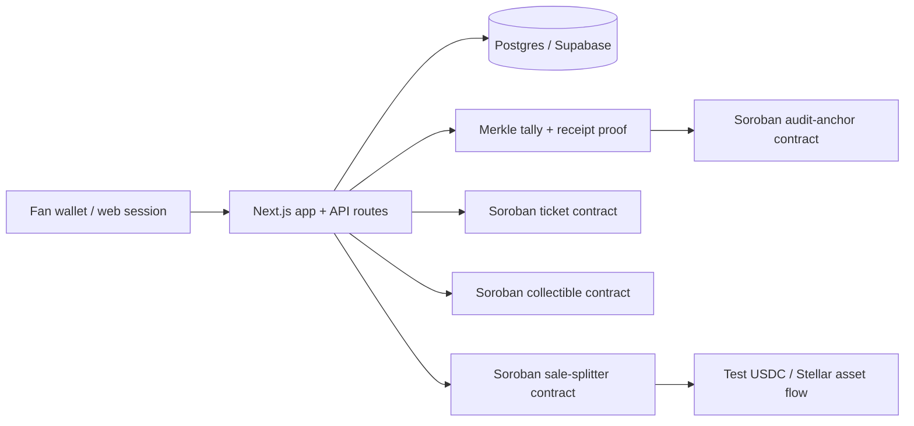

# CrownFi

CrownFi is a blockchain-assisted voting, ticketing, and fan-engagement MVP for pageants. It combines a fast off-chain web app with Stellar/Soroban primitives for audit proofs, payments, ticket ownership, and digital collectibles.

> **Status:** hackathon/testnet MVP. This repository is suitable for demos, review, and iteration. It is **not** production-ready voting or real-money infrastructure yet.

## What CrownFi does

CrownFi is built around three user groups:

- **Fans** vote, buy tickets, collect contestant memorabilia, and view receipts/rewards.
- **Organizers/admins** create contestants, open/close voting rounds, anchor results, and manage organizer requests.
- **Contestants** can receive support through collectible sales and payout splits.

The important design choice is that CrownFi does **not** try to put every vote on-chain. Voting intake stays off-chain for speed and privacy; Stellar is used as the trust/value layer.



## Repository layout

```text
.
├── web/                    # Next.js 15 app: UI, API routes, Prisma, wallet flows
├── contracts/              # Soroban Rust workspace: voting anchor, tickets, collectibles, sale splitter, test USDC
├── docs/                   # Architecture, design notes, and security audit notes
├── USER_FLOW.md            # Demo walkthrough for fan and admin flows
├── SUPABASE.md             # Supabase/Postgres setup
├── WORKFLOW.md             # End-to-end system workflow
├── SECURITY.md             # Security policy and reporting notes
└── DEPLOY.md               # Deployment pointers
```

## Stack

| Area | Technology |
|---|---|
| Web app | Next.js 15 App Router, React 19, TypeScript, Tailwind CSS |
| API/backend | Next.js route handlers |
| Database | Prisma + Supabase Postgres |
| Wallet | Freighter for Stellar wallet connection/signing |
| Blockchain | Stellar Testnet + Soroban Rust contracts |
| Contracts | `audit-anchor`, `ticket`, `collectible`, `sale-splitter`, `usdc-test` |
| CI/security | GitHub Actions, npm audit, TypeScript, Merkle tests, Rust format/tests/audit, secret smoke test, best-effort CodeQL |

## Architecture summary

### Voting

Votes are stored in Postgres and constrained at the database/application layer. When a voting round closes, CrownFi computes a tally hash and Merkle root. The Merkle root is anchored through the `audit-anchor` Soroban contract so published results can be checked later without exposing voter identity on-chain.

### Tickets

Tickets are represented by the `ticket` Soroban contract. The contract includes owner-gated minting, max supply support, pause support, and a resale-open flag intended for anti-scalping flows.

### Collectibles

Contestant portraits/memorabilia are represented by the `collectible` Soroban contract. The contract supports capped supply, owner-gated minting, pause support, and royalty-style metadata hooks.

### Sales and payout splits

The `sale-splitter` contract stores listing prices and contestant payout addresses. Buyers authorize payment, and the contract computes the platform/contestant split from stored listing data instead of trusting caller-supplied price or recipient values.

### Test USDC

The `usdc-test` contract is a mintable demo token for testnet/demo flows. It is not real USDC and must not be presented as production settlement infrastructure.

## Quick start: web app in mock mode

The app runs in mock mode by default. You only need Supabase/Postgres to exercise most of the MVP locally.

### Requirements

- Node.js 22+ recommended, or Node 24 to match CI
- npm
- Supabase project with Postgres connection strings

### Setup

```bash
cd web
cp .env.example .env
npm ci
npx prisma migrate dev --name init
npm run seed
npm run dev
```

Open:

```text
http://localhost:3000
```

Add your Supabase connection strings in `web/.env`:

```env
DATABASE_URL="postgresql://...pooler.supabase.com:6543/postgres?pgbouncer=true"
DIRECT_URL="postgresql://...pooler.supabase.com:5432/postgres"
```

For a full walkthrough, use [`SUPABASE.md`](SUPABASE.md) and [`USER_FLOW.md`](USER_FLOW.md).

## Demo flow

A minimal reviewer/demo path:

1. Start the app.
2. Connect/create a fan account.
3. Vote for a contestant.
4. Sign in as admin using an allowlisted Stellar wallet.
5. Create or close a voting round.
6. Anchor the round result.
7. Verify a vote receipt against the Merkle root.
8. Try ticket and collectible purchase flows in mock mode or testnet mode.

## Environment variables

The main environment file is `web/.env`. Start from `web/.env.example`.

### Database

| Variable | Purpose |
|---|---|
| `DATABASE_URL` | Pooled Supabase/Postgres connection for app runtime |
| `DIRECT_URL` | Direct Postgres connection for Prisma migrations |

### App/wallet mode

| Variable | Purpose |
|---|---|
| `WALLET_PROVIDER` | `mock` by default; `privy` stub exists for future embedded wallets |
| `STELLAR_MODE` | `mock` by default; use `live` after contracts are deployed/configured |
| `STELLAR_NETWORK` | Usually `testnet` during the hackathon/demo phase |
| `STELLAR_RPC_URL` | Soroban RPC endpoint |
| `NEXT_PUBLIC_STELLAR_NETWORK` | Client-visible Freighter network label |
| `NEXT_PUBLIC_STELLAR_NETWORK_PASSPHRASE` | Client-visible Stellar network passphrase |

### Admin authentication

| Variable | Purpose |
|---|---|
| `ADMIN_WALLETS` | Server-side comma-separated allowlist of admin `G...` addresses |
| `NEXT_PUBLIC_ADMIN_WALLETS` | Client UI hint only; not a security boundary |
| `ADMIN_SESSION_SECRET` | HMAC secret for httpOnly admin session cookies |
| `NEXT_PUBLIC_APP_ORIGIN` | Optional app origin used in challenge text |

Generate a strong admin session secret with:

```bash
openssl rand -base64 32
```

### Stellar contract IDs

When using `STELLAR_MODE=live`, set the deployed Soroban contract IDs:

| Variable | Purpose |
|---|---|
| `AUDIT_ANCHOR_CONTRACT_ID` | Round Merkle/tally anchor contract |
| `TICKET_CONTRACT_ID` | Ticket NFT contract |
| `COLLECTIBLE_CONTRACT_ID` | Collectible NFT contract |
| `SALE_SPLITTER_CONTRACT_ID` | Listing and USDC split contract |
| `USDC_TEST_CONTRACT_ID` | Demo/test USDC contract |
| `STELLAR_PLATFORM_SECRET` | Server-only platform signing key for platform-authorized operations |
| `DEMO_CONTESTANT_PAYOUT` | Demo payout wallet used by listing registration scripts |

Do not commit `.env`, private keys, seed phrases, database passwords, Supabase service-role keys, or Stellar secret keys.

## Smart contracts

Contracts live in [`contracts/`](contracts/).

```text
contracts/
├── audit-anchor/    # write-once voting round checkpoints
├── ticket/          # ticket NFT with resale/pausing/supply policy
├── collectible/     # contestant collectible NFT with royalty-style hooks
├── sale-splitter/   # listing-based USDC split contract
└── usdc-test/       # mintable test token for demos
```

### Contract checks

```bash
cd contracts
cargo fmt --all -- --check
cargo test --workspace --locked
cargo audit
```

`cargo audit --deny warnings` currently reports advisory warnings from transitive Soroban/Arkworks dependencies. These are documented in [`docs/SECURITY_AUDIT.md`](docs/SECURITY_AUDIT.md) and are kept visible but non-blocking in CI.

### Testnet deployment

Install the toolchain:

```bash
rustup target add wasm32v1-none
cargo install --locked stellar-cli
```

Generate and fund a testnet identity:

```bash
stellar keys generate alice --network testnet --fund
```

Build contracts:

```bash
cd contracts
stellar contract build
```

Use [`contracts/DEPLOY_GUIDE.md`](contracts/DEPLOY_GUIDE.md) for the full deployment runbook and contract wiring steps.

## Security posture

The mainline includes an initial MVP security hardening pass.

Fixed/improved areas include:

- server-side wallet-signed admin sessions using Freighter message signing;
- httpOnly admin session cookies;
- server-side protection on sensitive admin routes;
- short-lived transaction intents for signed XDR confirmation;
- live-mode rejection for direct mock mint endpoints;
- faucet rate/amount limits;
- npm dependency audit cleanup;
- secret smoke tests in CI;
- removal of local/generated artifacts from version control.

Current known limitations:

- Fan/user wallet sessions are not yet cryptographically enforced server-side across all flows.
- Payment and mint are not fully atomic yet.
- In-memory challenges, sessions, rate limits, and transaction intents are demo/server-singleton only.
- Contract deployment IDs and live-mode configuration need final testnet validation before demo day.
- A deeper external contract/security review is required before any mainnet or real-money use.

See [`SECURITY.md`](SECURITY.md) and [`docs/SECURITY_AUDIT.md`](docs/SECURITY_AUDIT.md) for details.

## CI checks

GitHub Actions are configured to run checks that do not require special repository permissions:

- `npm audit --audit-level=moderate`
- TypeScript check through `prisma generate && tsc --noEmit`
- Merkle proof tests
- Rust formatting
- Rust contract tests
- blocking `cargo audit` vulnerability check
- non-blocking `cargo audit --deny warnings` advisory report
- committed-secret smoke test
- best-effort CodeQL scan without result upload

CodeQL is intentionally best-effort because this repository may not have GitHub Code Scanning/GitHub Advanced Security enabled. Dependency Review/Dependabot-style checks are not required by this workflow because the current repository permissions may not support them.

## Local validation commands

Run these before pushing or asking for review:

```bash
cd web
npm ci
npm audit --audit-level=moderate
npm audit --audit-level=moderate --omit=dev
npm run typecheck
npm run test:merkle
```

```bash
cd contracts
cargo fmt --all -- --check
cargo test --workspace --locked
cargo audit
```

Optional advisory visibility check:

```bash
cd contracts
cargo audit --deny warnings
```

## Useful docs

| Document | Purpose |
|---|---|
| [`USER_FLOW.md`](USER_FLOW.md) | Step-by-step fan/admin demo walkthrough |
| [`SUPABASE.md`](SUPABASE.md) | Supabase/Postgres setup |
| [`WORKFLOW.md`](WORKFLOW.md) | End-to-end workflow and system behavior |
| [`DEPLOY.md`](DEPLOY.md) | Deployment entry point |
| [`contracts/README.md`](contracts/README.md) | Contract overview and security layers |
| [`contracts/DEPLOY_GUIDE.md`](contracts/DEPLOY_GUIDE.md) | Soroban deployment guide |
| [`docs/ARCHITECTURE.md`](docs/ARCHITECTURE.md) | Architecture notes |
| [`docs/SECURITY_AUDIT.md`](docs/SECURITY_AUDIT.md) | Security audit notes and remaining risks |

## MVP boundaries

CrownFi should be presented as:

> A scalable off-chain voting MVP with Stellar-anchored audit proofs, Stellar/Soroban ticket and collectible primitives, and testnet payment-split flows.

CrownFi should **not** be presented as:

- a production voting authority;
- a mainnet-ready financial application;
- a system where Stellar directly processes every vote;
- a complete replacement for legal tabulation, identity verification, or event ticketing compliance.

Keep demos on testnet/mock mode until the remaining production risks are addressed.
