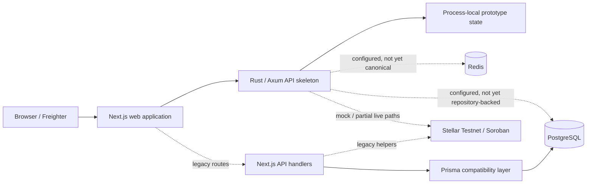

# CrownFi current platform architecture

This document describes the repository as it exists during the platform consolidation. It is not a future-state diagram and it must not hide transitional or mock-only behavior.

## Architectural decision

CrownFi is hybrid and Stellar-first where blockchain provides real utility:

- vote intake, eligibility, deduplication, and tallying are off-chain for scale and privacy;
- closed-round commitments can be anchored to Soroban;
- tickets, collectibles, payments, ownership, and settlement use Stellar/Soroban where live Testnet integrations are configured;
- raw voter identity and individual vote selections remain off-chain;
- purchases and fan support do not increase vote power.

## Current runtime



The Rust service exists and is part of the canonical direction, but it does not yet own durable organizations, pageants, contestants, votes, snapshots, markets, or transaction intents.

## Canonical responsibility boundaries

### Next.js

Owns:

- rendering and navigation;
- forms and interaction state;
- Freighter connection and signing approval;
- loading, empty, failure, unauthorized, and retry UX;
- generated API clients as domains migrate.

Must not permanently own:

- vote rules;
- payment settlement;
- order fulfillment;
- mint authority;
- KYC policy;
- market accounting;
- chain indexing or reconciliation.

### Rust/Axum API

Canonical owner for:

- organizations and memberships;
- pageants, categories, contestants, and sections;
- voting and snapshots;
- ticket and collectible commerce;
- transaction intents;
- provider webhooks;
- audit logs;
- Stellar indexing and reconciliation;
- asynchronous jobs.

Current limitation: most of this is not implemented durably yet.

### PostgreSQL

Will be authoritative for application and workflow state. SQLx migrations become the canonical schema authority in Milestone B.

The current Compose bridge still runs Prisma `db push` and a demo seed so the existing web MVP remains testable.

### Redis

Will own distributed rate limits, short-lived coordination, locks, and job support where appropriate. The container and URL are present, but the Rust API does not yet use Redis as a durable platform dependency.

### Stellar/Soroban

Authoritative for confirmed ledger transactions, contract events, on-chain ownership, settlement, and audit commitments.

The database must not declare a mint, payment, ownership transfer, or market settlement successful before chain confirmation and reconciliation.

## Current service inventory

| Service/capability | Current state |
|---|---|
| Next.js web | Working MVP and UI surface |
| Next.js API routes | Legacy/compatibility business layer |
| Rust API | Running skeleton with health/readiness and in-memory domain prototypes |
| PostgreSQL | Available through Compose; canonical SQLx schema not created |
| Redis | Available through Compose; canonical use incomplete |
| Database initializer | Transitional Prisma `db push` plus demo seed |
| Worker | Not a separate service yet |
| Stellar adapter/indexer | Not a separate durable service yet |
| Cloudflare R2 | Planned for Milestone B, not active |
| KYC provider | Planned for Milestone C, not active |

## Clean-clone path

The canonical reproducibility command is:

```bash
bash scripts/acceptance/clean-clone-smoke.sh
```

It checks PostgreSQL, Redis, the Rust API, transitional database initialization, and the web application. See [`../setup/clean-clone.md`](../setup/clean-clone.md).

The complete Milestone A gate remains open until the missing worker/Stellar processing boundaries and human clean-clone verification are resolved.

## Data and migration authority

See [`database-migration-ownership.md`](database-migration-ownership.md).

Summary:

- SQLx under `services/api/migrations/` becomes canonical;
- Prisma remains temporary compatibility/reference material;
- new domains must not be built only in Prisma;
- seed data is separate from migrations;
- migration files are serialized shared infrastructure.

## Testnet deployment authority

See [`../blockchain/testnet-contract-registry.md`](../blockchain/testnet-contract-registry.md).

A configured contract ID is not considered verified until the network, WASM hash, source revision, deployment transaction, and independent Explorer check are recorded.

## Known hardcoded/prototype state

The following remain migration fixtures rather than product architecture:

- seeded pageant/event data;
- seeded contestants/categories/market;
- in-memory votes, tallies, snapshots, markets, and intents in Rust;
- Prisma floating-point commerce prices;
- global/demo administrator assumptions;
- mock Stellar transaction results;
- direct server-side platform signer compatibility paths;
- duplicated Next.js and Rust business routes.

See [`../planning/CAPABILITY_AND_HARDCODING_INVENTORY.md`](../planning/CAPABILITY_AND_HARDCODING_INVENTORY.md).

## Target transition order

1. Finish Milestone A reproducibility, documentation, registry, and ownership decisions.
2. Add SQLx, PostgreSQL repositories, organizations, pageants, contestants, sections, and R2 media.
3. Migrate one vertical domain at a time from Next.js routes to Rust.
4. Introduce persistent transaction intents, workers, indexers, and reconciliation.
5. Remove legacy Prisma/Next.js business routes only after replacement acceptance tests pass.

## Honest status statement

CrownFi currently has a real multi-service platform path and preserved MVP behavior, but it is still transitional. It should not be described as a completed Rust platform, a fully persistent multi-tenant product, or production-ready Stellar infrastructure until the acceptance gates are met.
