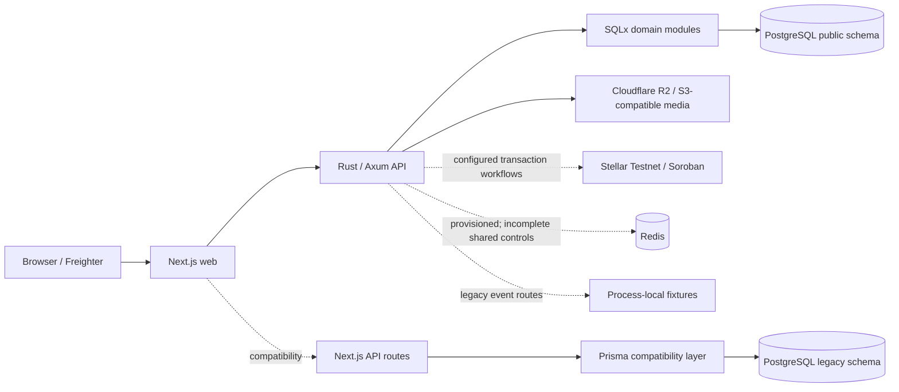

# CrownFi current platform architecture

This document describes the default-branch implementation after the July 2026 PR-history consolidation. Future-state plans and acceptance evidence remain separate.

## Architectural decision

CrownFi is hybrid and Stellar-first where blockchain provides useful public truth:

- vote intake, eligibility, deduplication, and tallying are off-chain;
- immutable closed-round commitments can be anchored to Soroban;
- tickets, collectibles, payments, ownership, settlement, and audit commitments use Stellar/Soroban when live integrations are configured;
- raw voter identities and individual vote selections remain off-chain;
- purchases and fan support never increase voting power.

## Current runtime



The Rust service contains persistent platform, identity/ACL, media, catalogue, orders, Stellar intents/reconciliation, fulfillment, payouts, voting, ticketing, and market position/settlement modules. Older event/tally/snapshot handlers in `services/api/src/app.rs` remain process-local demonstration paths.

## Authority boundaries

### Next.js

Owns:

- rendering, navigation, responsive application shells, and browser interaction state;
- pageant-aware public and management composition;
- Freighter connection and user signing approval;
- httpOnly CrownFi account sessions;
- loading, empty, failure, unauthorized, and retry UX;
- server-side proxying into protected Rust routes.

Must not permanently own:

- vote rules and tally truth;
- inventory, payment, issuance, or order settlement;
- mint authority;
- KYC policy;
- prediction-market accounting;
- chain indexing or reconciliation.

Selected Next.js/Prisma business routes remain compatibility code until their Rust replacements and browser acceptance gates pass.

### Rust/Axum API

Merged PostgreSQL-backed modules own or model:

- users, Stellar account links, site administrators, organizations, memberships, pageants, categories, contestants, pageant participation, sections, and audit records;
- R2 media lifecycle, contestant attachments, and same-asset completion serialization;
- products, integer prices, inventory, orders, payment attempts/events;
- transaction intents, submissions, contract registry data, chain evidence, and reconciliation results;
- collectible fulfillment and payout workflows;
- voting rounds, accepted votes, receipts, snapshots, Merkle proofs, and anchor-intent/evidence records;
- ticket events/products, reservations, issuance, ownership/transfer evidence, verification, and check-in records;
- Testnet-gated market policy/lifecycle/stake intent, accepted positions, exposure, and deterministic settlement/refund evidence;
- centralized capability/scope authorization and authorization-decision logging.

The route inventory is in [`../api/RUST_API_ENDPOINTS.md`](../api/RUST_API_ENDPOINTS.md).

The newer voting, ticketing, and market route groups still need complete centralized capability classification, worker/indexer transport restrictions, authority separation, and negative authorization tests. Direct handler checks are implementation defenses but do not replace the shared ACL acceptance gate.

### PostgreSQL

The `public` schema is canonical for new platform data and is managed by append-only SQLx migrations under `services/api/migrations/`.

The `legacy` schema is temporary compatibility storage for Prisma-backed Next.js routes. It must not become the authority for new platform domains.

### Redis

Redis is provisioned in the canonical Compose stack. It is intended for distributed rate limits, short-lived coordination, and job support. The current API does not yet use it as the complete shared control plane.

### R2

Cloudflare R2, or an explicit S3-compatible test adapter, is authoritative for uploaded media bytes. PostgreSQL is authoritative for object identity, lifecycle status, integrity metadata, visibility, and relationships.

Completion requests for one media asset are serialized across API processes by a PostgreSQL transaction-scoped advisory lock. This closes the concrete duplicate-completion race; it does not implement variants, expiry, orphan cleanup, replacement/removal, or retirement policy.

R2 credentials stay server-side. KYC identity documents must not be stored in the general CrownFi media bucket.

### Stellar/Soroban

The ledger is authoritative for confirmed transactions, contract events, on-chain ownership, settlement, and audit commitments.

A database row marked built, signed, submitted, planned, or pending is not ledger success. CrownFi requires accepted independently sourced chain evidence and reconciliation before exposing a completed result.

## Current service inventory

| Service/capability | Default-branch state |
|---|---|
| Next.js web | Active application, shared UI kit, responsive public shell, full-screen Manage workspace, modular pageant-home editor/renderer, and compatibility routes |
| Rust API | Active; persistent domain modules plus legacy in-memory event/tally routes |
| PostgreSQL | SQLx-owned `public` schema plus Prisma-owned `legacy` compatibility schema |
| SQLx migrations | Active and run by `db-init` |
| Explicit Rust demo seed | Implemented; opt-in, idempotent, blocked in staging/production |
| Redis | Provisioned; complete distributed controls remain unfinished |
| R2 media | Server-side upload/verification/attachment and completion lock implemented; full lifecycle/Media Library work remains |
| Voting | Durable SQLx implementation merged; ACL, real Testnet anchor/indexer, scale/restart, browser, and deployment acceptance remain |
| Ticketing | Durable catalogue/reservation/issuance/ownership/check-in implementation merged; ACL, real payment/issuance/indexer, recovery UI, and acceptance remain |
| Prediction markets | Deterministic Testnet-only positions/settlement implementation merged; policy, authority, real XDR/indexer/transfers, and acceptance remain |
| Stellar intents/reconciliation | Durable records and APIs implemented; real network evidence remains capability-specific |
| Worker/indexer | Workflow boundaries exist, but no complete independent general worker/indexer service |
| KYC/provider integration | Not complete |
| Arcturus deployment | Main-only immutable release path with cache acceleration and temporary legacy-preflight compatibility |

## Legacy in-memory routes

The following routes use process-local fixtures and must not be confused with persistent platform domains:

```text
GET  /events
GET  /events/:event_id
GET  /events/:event_id/contestants
POST /events/:event_id/vote
GET  /events/:event_id/tally
POST /admin/events/:event_id/snapshot
POST /admin/snapshots/:snapshot_id/anchor
GET  /snapshots/:snapshot_id
GET  /snapshots/:snapshot_id/verify
```

They may remain temporarily for compatibility and demonstrations. Persistent claims must reference the corresponding SQLx route group and exact evidence.

## Clean-clone path

```bash
bash scripts/acceptance/clean-clone-smoke.sh
```

It builds PostgreSQL, Redis, SQLx initialization, the Rust API, Prisma compatibility initialization, and Next.js. It proves startup and basic readiness—not complete authorization, product behavior, Testnet settlement, concurrency/restart recovery, or production deployment.

See [`../setup/clean-clone.md`](../setup/clean-clone.md).

## Current-state rule

Use [`../status/CURRENT_IMPLEMENTATION_STATUS.md`](../status/CURRENT_IMPLEMENTATION_STATUS.md) as the dated status record. Merged implementation, automated checks, human acceptance, Testnet proof, and deployed-SHA evidence must remain distinct.
